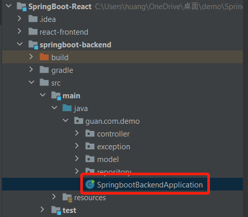

<h1 align="center">
  Employee Management system
  <br>
</h1>

<h4 align="center">Full stack (Spring Boot + React + MySQL8)</h4>

<p align="center">
  <a href="#key-features">Key Features</a> •
  <a href="#how-to-use">How To Use</a> •
  <a href="#Future">Future</a> 
</p>

## Key Features

* View all profiles 
* Create new profile
* Delete profile from the data source
* Edit profile by ID

## How To Use

```bash
# Clone this repository
$ git clone https://github.com/54hg0220/SpringBoot-React.git
```
**Database** MySQL8
```bash
# Create employee table in your local db
$ create table ems
```

**MainEntry** of the backend



**MainEntry** of the frontend
use vs code open react-frontend folder, and use following command to enter the app:
```bash
# Install dependencies and start front-end
$ npm install
npm start 
```
## Future
Search by name function
